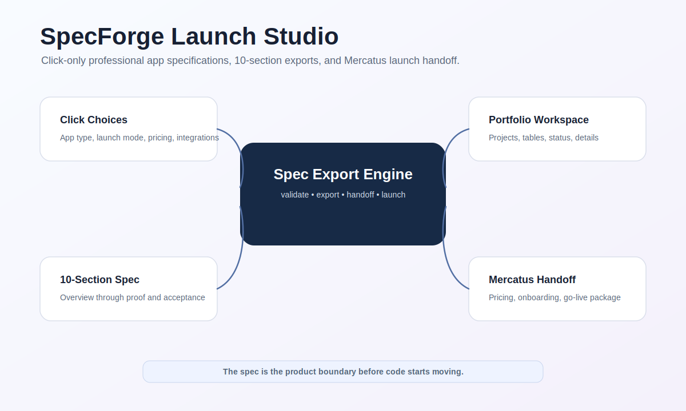

# Capsule Studio




Desktop-style frontend and API platform for visually designing professional app specifications with click-only choices, managing project work, browsing clone-ready apps, and preparing Launcher publish flows.

SpecForge is the product-spec side of NOVA Build: it turns app ideas into a complete 10-section specification, then hands the launch package to Mercatus Launch Studio for pricing and go-live support.

## Human Flow

1. Pick app type, launch mode, pricing model, and integrations.
2. Complete all 10 spec sections.
3. Validate missing sections.
4. Export Markdown package.
5. Hand the result to Mercatus for pricing and go-live.

See `docs/HUMAN_AI_WORKFLOWS.md` for human and AI worker flows.
Capsule Studio is a capsule-first builder, launcher, sandbox, and deployment platform. It turns app specs, code sessions, native modules, web workers, previews, reports, and GitHub publishing into one operating surface.

The original SpecForge surface is still inside the product: the builder creates professional app specifications, the launcher packages clone-ready apps, and the sandbox turns coding sessions into deployable capsules.

## Core Platform

- Visual app specification builder
- Multi-language coding sandbox
- Live Python API server
- Local preview server
- MCP-style Python inner server
- AI provider bridge
- Expo Go mobile capsule generator
- Web/API/terminal/notebook/artifact preview model
- Capsule manifest system
- Web worker capsule scaffolds
- Native C/C++ interface
- WASM/WASI deployment targets
- GitHub publishing handoff
- Background daemon model

## Capsule Lanes

Capsule Studio defines runtime lanes for:

- Python
- Java
- C
- C++
- React
- TypeScript
- Node.js
- HTML / CSS / JavaScript
- Julia
- MATLAB / Octave-style scientific sessions
- Rust
- Go
- R
- Shell

Language lanes are marked as ready, planned, or toolchain-required. The platform does not pretend every compiler is already installed. It creates the product architecture, manifest contracts, worker contracts, and local runtime handoff path so real compilers and WASM/WASI bridges can be attached cleanly.

## Product Surface

- Builder/Launcher/Capsule Studio home surface
- Click-only 10-section spec builder
- Portfolio and project workspace with detailed table view
- App marketplace with creator profiles
- Guided post-clone setup
- 6-step Launcher onboarding: Brand, Audience, Content, Features, Updates, Go Live
- Pricing advisor formula: `base + complexity + support + market`
- Native C/C++ scoring and export interface
- Multi-language sandbox for code sessions and deployable capsules

## Run the Frontend

```bash
npm install
npm run dev
```

Open `http://127.0.0.1:5190`.

## Run the Python Capsule Runtime

Start the local API server:

```bash
python -m capsule_studio.cli api
```

Start the preview server:

```bash
python -m capsule_studio.cli preview
```

Create and run a capsule session:

```bash
python -m capsule_studio.cli runtimes
python -m capsule_studio.cli create python --name demo-python
python -m capsule_studio.cli run demo-python
python -m capsule_studio.cli manifest demo-python
python -m capsule_studio.cli wasm-plan native/specforge_core.cpp --kind cpp
```

API server: `http://127.0.0.1:8764`

Preview server: `http://127.0.0.1:8765`

## MCP Inner Server and AI Bridge

Run the local JSON-RPC tool server:

```bash
python -m capsule_studio.mcp.server
```

Offline-safe AI mode:

```bash
CAPSULE_AI_PROVIDER=local python -m capsule_studio.mcp.server
```

OpenAI-compatible mode:

```bash
CAPSULE_AI_PROVIDER=openai OPENAI_API_KEY=... python -m capsule_studio.mcp.server
```

The MCP-style server exposes tools for runtime listing, session creation, file writing, session run, manifest generation, deploy plans, AI code generation, AI review, and WASM planning.

## Expo Go Mobile Capsules

Generate a mobile capsule users can preview with Expo Go:

```bash
python -m capsule_studio.cli expo --name "Capsule Mobile App" --slug capsule-mobile-app --out .capsule_studio/expo/capsule-mobile-app
cd .capsule_studio/expo/capsule-mobile-app
npm install
npm run start
```

Scan the QR code with Expo Go to preview the app on a phone.

## Static Preview

```bash
python3 launch_static.py
```

## Capsule Studio Utility

Generate and verify capsule manifests locally:

```bash
python tools/capsule_studio.py list
python tools/capsule_studio.py verify
python tools/capsule_studio.py make python
python tools/capsule_studio.py make react
python tools/capsule_studio.py make cpp
```

Generated manifests are written to `artifacts/capsule-studio/`.

## Capsule Manifest System

Capsules live under `capsules/`:

- `capsules/schema/capsule.schema.json`
- `capsules/examples/react-worker-agent.capsule.json`
- `capsules/examples/python-orchestrator.capsule.json`
- `capsules/examples/cpp-wasm-core.capsule.json`

A capsule can deploy as:

- web worker agent
- full web app
- WASM kernel
- local service
- report suite
- GitHub release package

## Web Worker Capsules

Worker scaffolds:

- `src/workers/capsule.worker.ts`
- `src/workers/preview.worker.ts`

These define the first browser-side capsule workers for manifest scoring, preview preparation, and deploy metadata.

## Native C/C++ Interface

The `native/` folder provides a working C ABI and C++ implementation for the scoring/export core.

```bash
c++ -std=c++17 native/specforge_core.cpp native/specforge_cli.cpp -o native/specforge_cli
c++ -std=c++17 native/specforge_core.cpp native/tests/specforge_native_tests.cpp -o native/specforge_native_tests
native/specforge_cli score
native/specforge_cli export
native/specforge_native_tests
```

Native files:

- `native/specforge_core.h` — C ABI header
- `native/specforge_core.cpp` — C++ scoring/export engine
- `native/specforge_cli.cpp` — command line interface
- `native/tests/specforge_native_tests.cpp` — smoke tests

## Documentation

- `docs/mcp-ai-expo-bridge.md`
- `docs/python-capsule-runtime.md`
- `docs/capsule-studio-platform.md`
- `docs/capsule-sandbox.md`
- `docs/product-surface.md`
- `docs/component-system.md`
- `docs/github-attach.md`

## Verify

```bash
npm run verify
npm run build
python tools/capsule_studio.py verify
python -m pytest tests/test_capsule_studio.py
```

GitHub Actions verifies the frontend, the native C++ interface, the Capsule Studio manifest utility, and the Python capsule runtime.
